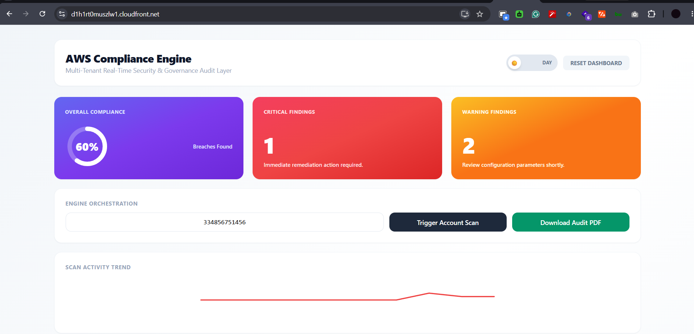
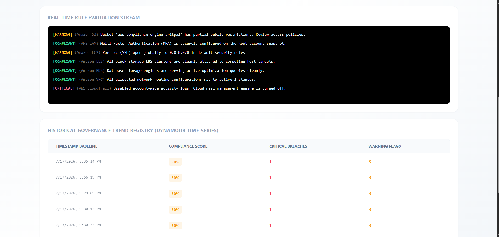
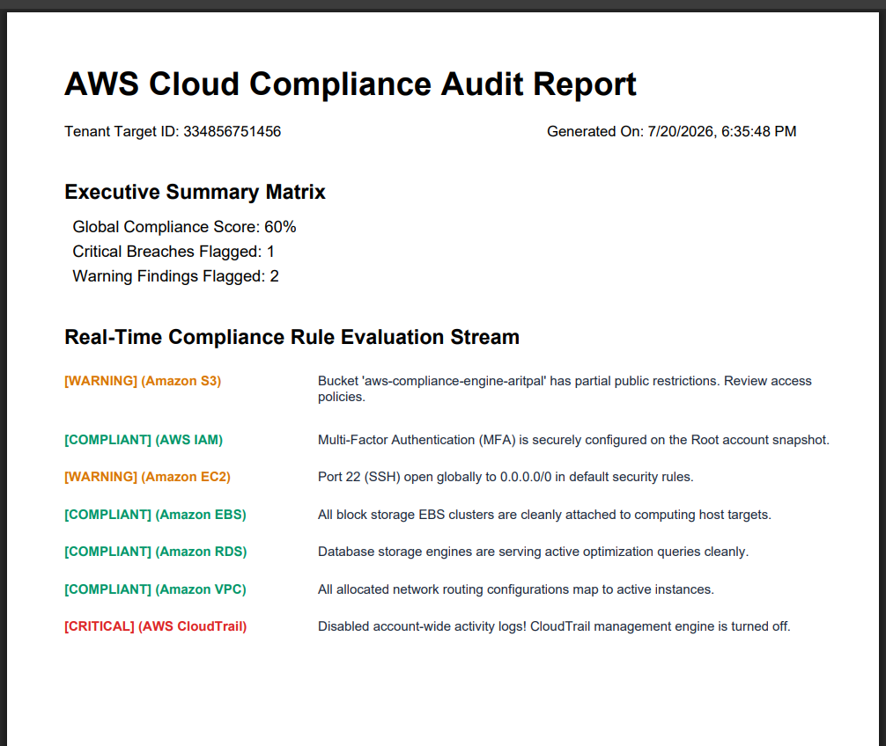

# AWS Compliance Engine

### Multi-Tenant Real-Time Security & Governance Audit Layer

A cloud-native security auditing platform built to scan AWS infrastructure in real time against key CIS benchmarks, evaluate risk configurations, and track compliance trends over time.

---

## 🛠️ System Architecture

```
[ React Frontend (SPA) ] 
       │
       │ Static Assets
       ▼
[ Amazon S3 Bucket ] ──► [ Amazon CloudFront (CDN + SSL) ]
                               │
                        /api/* │ Unified Reverse Proxy
                               ▼
                    [ Amazon EC2 (FastAPI + systemd) ]
                               │
               ┌───────────────┴───────────────┐
               ▼                               ▼
       [ AWS SDK (boto3) ]            [ Amazon DynamoDB ]
   (S3, IAM, EC2, EBS, RDS)        (Audit Trend History Logs)
```

---

## ✨ Key Features

- **Real-Time Rule Evaluation:** Audits core AWS services (IAM, S3, EC2, EBS, RDS, VPC, CloudTrail) for common security misconfigurations (e.g., publicly open SSH ports, missing MFA, unencrypted storage).
- **Unified API Gateway Proxying:** Leverages Amazon CloudFront to serve both the React static frontend and route `/api/*` requests to the FastAPI backend under a single secure HTTPS domain, eliminating CORS headaches.
- **Time-Series Compliance Tracking:** Persists scan history in Amazon DynamoDB using `account_id` as a tenant isolation key to render trend analytics across audit runs.
- **Production Daemon Setup:** FastAPI backend runs as a managed `systemd` daemon on EC2 with auto-restart on instance reboots.
- **Automated Audit Exports:** Client-side generation of detailed PDF compliance reports for offline security reviews.

---

## 🚀 Tech Stack

- **Frontend:** React, Tailwind CSS, Lucide Icons
- **Backend:** Python, FastAPI, Uvicorn, Boto3 (AWS SDK)
- **Database:** Amazon DynamoDB
- **Hosting & CDN:** Amazon S3, Amazon EC2, Amazon CloudFront

---

## 🛠️ System Architecture


## 📸 Application Screenshots

### Executive Dashboard


### Real-Time Rule Evaluation Stream


### Generated Audit PDF Report


## ⚡ Local Setup & Development

### 1. Prerequisites

- Python 3.10+
- Node.js & npm
- AWS CLI configured with valid credentials (`aws configure`)

### 2. Backend Setup

```bash
# Clone repository
git clone https://github.com/Aritpal15/aws-compliance-engine.git
cd aws-compliance-engine/backend

# Create virtual environment & install dependencies
python3 -m venv venv
source venv/bin/activate  # On Windows: venv\Scripts\activate
pip install -r requirements.txt

# Run backend
uvicorn main:app --reload --port 8000
```

### 3. Frontend Setup

```bash
cd ../frontend

# Install dependencies
npm install

# Start development server
npm start
```

---

## ☁️ Cloud Deployment Overview

- **Frontend:** Built via `npm run build` and hosted on S3 with Static Website Hosting.
- **Backend:** Deployed on an EC2 instance, managed by `systemd` for 24/7 reliability.
- **Routing:** CloudFront fronts the entire application, serving static assets from edge locations while proxying `/api/*` directly to EC2 over HTTP port 8000.

---

## 📌 Architecture Note on Multi-Tenancy

The database schema is designed with tenant isolation in mind, partitioning audit logs by `account_id`. In a full multi-tenant enterprise deployment, the backend can be extended to assume cross-account IAM roles (`sts:AssumeRole`) using delegated `ExternalID` trust policies to scan external AWS accounts seamlessly.